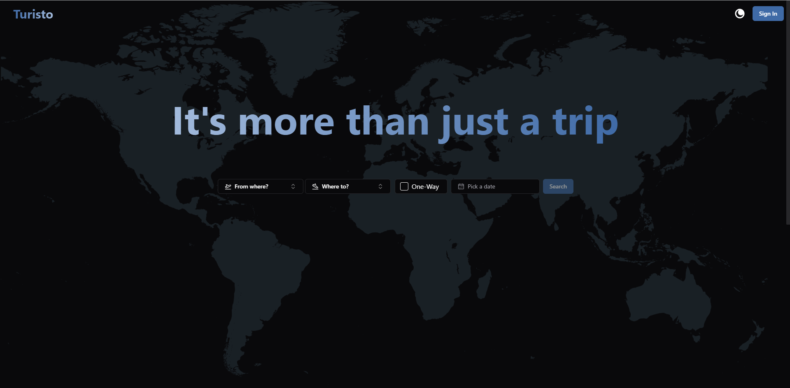
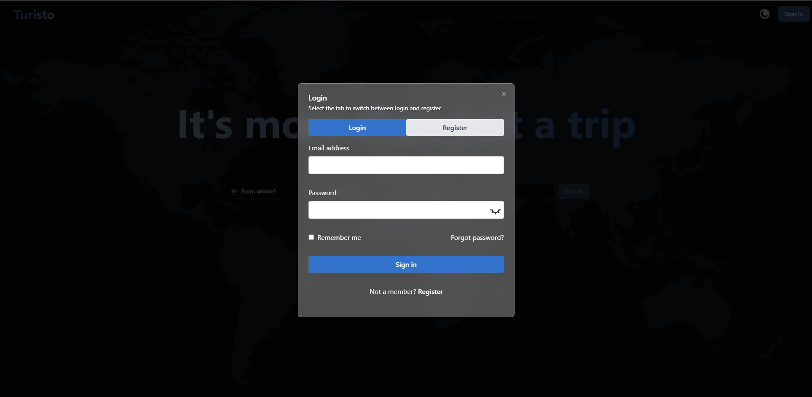
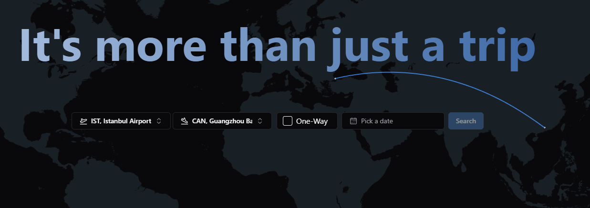
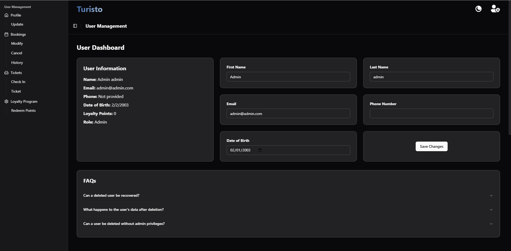
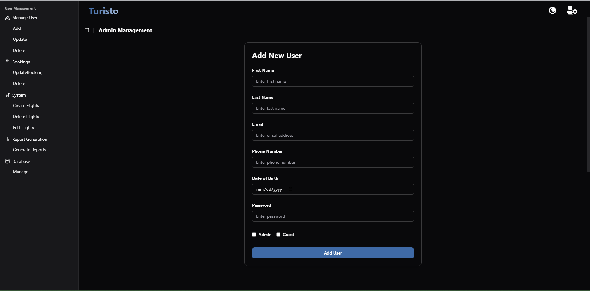

# Airline Ticket MIS

## Overview

A Management Information System for managing airline ticket bookings.

## Main features
1. **User Registration and Profile Management**  
Users can create and manage their accounts, including personal details and preferences.
2. **Ticket Search**  
Allows users to search for available tickets based on criteria such as date, destination, and service type.
3. **Ticket Booking**  
Enables users to book tickets by selecting flights, seats, and other preferences.
4. **Payment Processing**  
Integrates with dummy payment gateways to securely process transactions for ticket purchases.
5. **Booking Confirmation and Ticket Generation**  
Issues a confirmation of booking and generates a digital ticket after successful payment.
6. **Booking History**  
Users can view their past bookings and display tickets for their records.
7. **Ticket Cancellation**  
Provides functionality to cancel bookings and process refunds according to the cancellation policy.
8. **Booking Modification**  
Allows users to modify their existing bookings, including changes to dates and seat selections.
9. **Discounts and Promotions**  
Users can apply discount codes or promotional offers during the booking process.
10. **Loyalty Program**  
Enables users to earn and redeem loyalty points through a structured rewards program.
11. **Group Booking**  
Provides options for booking multiple tickets simultaneously for groups, with special handling for group discounts.
12. **Check-in and Boarding Pass Issuance**  
Offers online check-in services and generates digital boarding passes for users.
13. **Flight Status Tracking**  
Allows users to track the real-time status of their flights, including delays and cancellations.
14. **Admin Dashboard**  
An administrative interface for managing user profiles, bookings, and system activities, managing the database..
15. **Report Generation**  
Generates reports on bookings, cancellations, revenue, and other key metrics to assist in business analysis and decision-making.

## Screenshots
### 1. Home Screen
*Description*: The initial landing page where users can select options to proceed with registration, login, or explore available flights. The UI adapts to the light or dark theme based on user preference.


### 2. Theme Toggle Feature
*Description*: Demonstrates the application's support for light and dark modes, ensuring accessibility and better user experience in varying lighting conditions.



### 3. User Authentication Screen
*Description*: The login and registration form that enables users to sign up or sign in to their accounts. Fields for email, password, and user credentials validation are included.



### 4. Flight Connections Overview
*Description*: A visual representation of airport connections, allowing users to explore available flight routes. It also serves as a planning tool for selecting connecting flights.



### 5. User DashBoard
*Description*:  A personalized dashboard for regular users. It features booking history, loyalty points, active bookings, and quick access to flight tracking or new ticket purchases.



### 6. Admin DashBoard
*Description*: A comprehensive administrative panel for managing users, bookings, flights, and generating system-wide reports. Includes role-based access and data visualization features.



## Getting Started

### Frontend Client (Vite + React)

1. Navigate to the `client` folder: `cd client`
2. Install dependencies: `npm install`
3. Create a `.env` file for environment variables based on `.env.example`.
4. Start the development server: `npm run dev`

### Backend Server (Express + TypeScript)

1. Navigate to the `server` folder: `cd server`
2. Install dependencies: `npm install`
3. Create a `.env` file for environment variables (refer to `.env.example` for required variables like `DB_USER`, `DB_PASSWORD`, etc.).
4. Start the server: `npm start` (production) or `npm run dev` (development with nodemon)

## Database Setup (PostgreSQL) (Local setup hosting soon...)

1. Install PostgreSQL on your local machine.
2. Create a database named `airline_ticketing_system`.
3. Use the schema file in the `server` folder (`schema.sql`) to create the `users` table for initial testing:
   ```bash
   psql -U postgres -d airline_ticketing_system -f server/schema.sql
   ```

## Packages Installed for reference:

### Frontend

- **React**: JavaScript library for building user interfaces
- **react-router-dom**: Routing library for React applications with multiple pages
- **react-icons**: Icon library for React
- **tailwindcss**: Utility-first CSS framework for faster styling
- **prettier-plugin-tailwindcss**: Formats Tailwind classes with Prettier
- **shadcn components**: Provides pre-built components with extensive customisability if needed

### Backend

- **Express**: Web framework for Node.js
- **TypeScript**: Typed superset of JavaScript
- **ts-node**: TypeScript execution environment for Node.js
- **bcryptjs**: Password hashing utility for securely storing user passwords
- **jsonwebtoken (JWT)**: For user authentication and authorization
- **pg**: PostgreSQL client for Node.js
- **dotenv**: Loads environment variables from a `.env` file
- **cookie-parser**: Middleware to parse cookies in requests
- **nodemon**: Automatically restarts the server during development
- **cors**: Enables cross-origin requests for API access during development

## Folder Structure

- `client/` - Frontend code using Vite and React
- `server/` - Backend code using Express and TypeScript
- `server/src/` - Contains TypeScript source files for the backend logic
- `server/schema.sql` - SQL script to create the initial `users` table for testing purposes